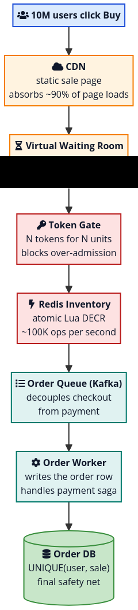

# Reference

https://singhajit.com/flash-sale-system-design/

This post is a working answer to how to design a flash sale system that you can defend in an interview, in a brown-bag, or in a production planning doc. It is not theoretical.

A flash sale has three promises. Everything else is a feature on top.

- Never sell more than the available stock. Selling fewer is fine. Selling unit 10,001 of a 10,000 unit batch is not.
- Charge each winning buyer exactly once. No duplicate orders, no duplicate payments.
- Stay up during the spike. The site cannot 502 the moment the timer hits zero.

That sounds modest. The hard part is the shape of the traffic. A typical e-commerce checkout sees a smooth load with a few peaks. A flash sale sees a vertical wall: traffic at noon minus one second is normal, traffic at noon is fifty times normal, and traffic at noon plus thirty seconds is back to normal because the sale is over.

